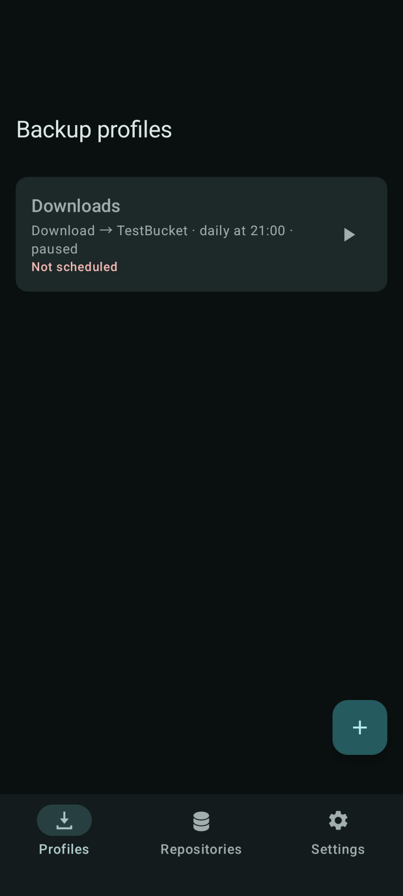
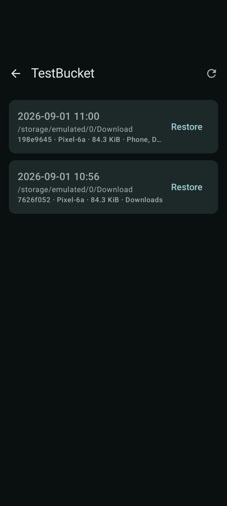
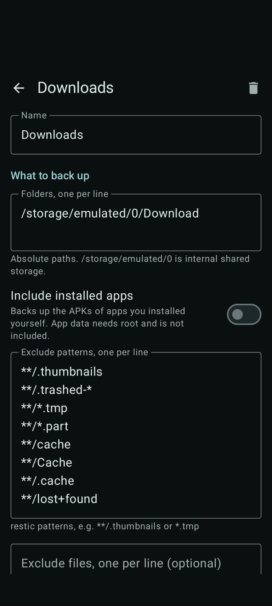

# ResticDroid

Scheduled, encrypted backups for Android, built on [restic](https://restic.net).

*Developed with Claude.*

restic has no Android port. ResticDroid cross-compiles restic, ships it inside
the app, and drives it as a child process. Snapshots it writes are ordinary
restic snapshots — open them with restic on any desktop, and nothing about them
depends on this app continuing to exist.

## Download

<p align="center">
  <a href="https://github.com/JayXT/ResticDroid/releases"></a>&nbsp;
  <a href="https://apps.obtainium.imranr.dev/redirect.html?r=obtainium://add/https://github.com/JayXT/ResticDroid"></a>
</p>

[Obtainium](https://github.com/ImranR98/Obtainium) tracks releases and updates
in the background; it picks the right APK for your device on its own, since the
ABI is in the filename. Downloading by hand, take the one matching your
device — `arm64-v8a` unless you know otherwise — and check it against the
release key's published SHA-256 with `apksigner verify --print-certs`.

F-Droid builds from source and signs with its own key, so an F-Droid install
and a GitHub install cannot upgrade one another. Switching means uninstalling,
which deletes the stored repository passwords.

## Screenshots

<p align="center">
  
  
  
</p>

## Features

- **Profiles** — what to back up, where, and when. Four ready-made starting
  points: photos and media, documents and downloads, installed apps, all of
  shared storage.
- **Conditions** — scheduled runs can require charging, an unmetered network,
  an idle device, a battery level, or particular Wi-Fi networks.
- **Repositories** — Backblaze B2, S3 and compatible services, Azure, Google
  Cloud Storage, Swift, restic's REST server, and local folders.
- **Snapshots** — browse them, see a snapshot's tags, paths, size and files,
  compare any two, forget one, restore in place or into a folder of its own.
- **Retention** — `restic forget` after each successful run, on the policy you
  set; pruning on its own schedule, since that is the expensive half, or on
  demand from the repository list.
- **Biometrics** — a fingerprint before anything you start yourself, falling
  back to the repository password. Scheduled runs are never prompted.
- **Configuration in plain files** you can read, edit and copy.
- **No recursive backups** — every local repository is excluded from every
  backup automatically.
- **No trackers**, no crash reporting, no advertising identifiers, and no
  connection to any server other than the repositories you configure.

## Requirements

Android 8.0 or later. No root. All files access, so a scheduled run can read
the files you chose without a picker in the way.

## Configuration is a directory of text files

```
/storage/emulated/0/ResticDroid/
├── resticdroid.conf      settings
├── destinations.d/       one file per repository
├── profiles.d/           one file per backup job
├── exclude.d/            optional shared exclude files
└── log/                  one log per run
```

Edit them with any text editor; the app notices and reloads. Repeating a key
adds to a list, and unknown keys are preserved untouched.

Credentials are **not** here — they are in the Android keystore. Copying this
directory to another device gives you the profiles but not the passwords.

### `resticdroid.conf`

| Key | Default | Meaning |
|---|---|---|
| `require-auth` | `yes` | Confirm before a backup, restore or snapshot browse you started. Scheduled runs are never prompted. |
| `hostname` | device model | Recorded in every snapshot. |
| `log-retention` | `20` | How many run logs to keep. |

### `destinations.d/<id>.conf`

The filename stem is the id profiles refer to.

| Key | Meaning |
|---|---|
| `name` | Shown in the app. |
| `backend` | `b2`, `local`, `rest`, `s3`, `azure`, `gs`, `swift`. |
| `location` | See below. |
| `setting.<name>` | A non-secret backend environment variable. |
| `option` | An extra restic flag, before the subcommand. Repeatable. |

| Backend | `location` | Credentials (keystore) |
|---|---|---|
| `b2` | `bucket:path` | `B2_ACCOUNT_ID`, `B2_ACCOUNT_KEY` |
| `local` | `/storage/emulated/0/Backups/restic` | — |
| `rest` | `https://host:8000/path/` | username, password (optional) |
| `s3` | `s3.amazonaws.com/bucket` | `AWS_ACCESS_KEY_ID`, `AWS_SECRET_ACCESS_KEY` |
| `azure` | `container:/path` | `AZURE_ACCOUNT_NAME` + key or SAS |
| `gs` | `bucket:/path` | `GOOGLE_PROJECT_ID`, service-account JSON |
| `swift` | `container:/path` | `OS_AUTH_URL`, `OS_USERNAME`, `OS_PASSWORD` |

For Google Cloud Storage, paste the *contents* of the service-account JSON, not
a path. Google's auth library only resolves a filesystem path, so ResticDroid
keeps the JSON in the keystore and writes it to an app-private file just before
each run — the one credential that must exist on disk at all.

`sftp` and `rclone` are absent by necessity: restic implements them by spawning
`ssh` and `rclone`, which stock Android does not have, and restic is run with
`PATH=/system/bin:/system/xbin` and nothing else. Run
[rest-server](https://github.com/restic/rest-server) beside your SSH server and
use `rest`, or expose the storage with MinIO and use `s3`.

### `profiles.d/<id>.conf`

| Key | Default | Meaning |
|---|---|---|
| `name` | filename | Shown in the app. |
| `enabled` | `yes` | A disabled profile keeps its settings but never runs. |
| `destination` | — | **Required.** Id of a file in `destinations.d`. |
| `path` | — | **Required** unless `include-apps`. Repeatable. |
| `exclude` | — | restic exclude pattern. Repeatable. |
| `exclude-file` | — | A bare name resolves in `exclude.d/`; an absolute path is used as written. Repeatable. |
| `tag` | — | Extra snapshot tag. The profile's name is always added. Repeatable. |
| `manual-tag` | — | Extra tag, added only to a run you start by hand. Repeatable. |
| `schedule` | `manual` | `manual`, `every <N>h`, or `daily HH:MM`. |
| `require-charging` | `no` | Scheduled runs only while charging. |
| `require-unmetered` | `yes` | Scheduled runs only on an unmetered network. |
| `require-idle` | `no` | Scheduled runs only when the device is idle. |
| `min-battery` | `0` | Skip below this percentage. Ignored while charging. |
| `wifi-ssid` | — | Restrict to these networks. Repeatable. Empty means any. |
| `keep-last`, `keep-hourly`, `keep-daily`, `keep-weekly`, `keep-monthly`, `keep-yearly`, `keep-within` | see below | Applied by `restic forget` after a successful run. |
| `prune` | — | Days between prunes. Unset prunes after every backup; `0` never does. |
| `exclude-caches` | `yes` | Skip directories tagged `CACHEDIR.TAG`. |
| `include-apps` | `no` | Also back up the APKs of apps you installed. |

New profiles start at `keep-last = 3`, `keep-daily = 14`, `keep-weekly = 12`,
`keep-monthly = 12`, `keep-yearly = 3`. Remove every `keep-*` line to keep all
snapshots forever.

```ini
# profiles.d/photos.conf
name = Photos
destination = backblaze

path = /storage/emulated/0/DCIM
path = /storage/emulated/0/Pictures

exclude = **/.thumbnails

schedule = daily 03:00
min-battery = 30
wifi-ssid = home

keep-daily = 14
keep-monthly = 12
```

Conditions apply to scheduled runs only — a run you start yourself always runs.
Wi-Fi SSIDs need the location permission, because Android ties the connected
network's name to it and offers nothing narrower.

Android batches background work, so `daily 03:00` starts *near* 03:00 and the
minimum practical interval is about 15 minutes. A run that misses its window is
retried when circumstances change rather than skipped until tomorrow.

## Security

Repository passwords and API keys are encrypted with AES-256-GCM under a key
generated in, and never leaving, the Android keystore — hardware-backed where
there is a secure element. Passwords reach restic through the environment,
never on the command line.

`option` lines in a destination file are allowlisted. The configuration
directory is writable by anything with storage access, and restic's
`--password-command` runs a shell command that outranks `RESTIC_PASSWORD`, so
an appended line would otherwise be arbitrary code execution at the next
unattended run. Only bandwidth, cache and verbosity flags are accepted.

Confirmation defends against someone picking up your unlocked phone. You are
asked for a fingerprint, or for the repository password if none is enrolled.
The device PIN is deliberately not accepted: it is often known to people around
you and it unlocks the phone already in the attacker's hand. Turning the
requirement off is itself authenticated and latched in the keystore, so editing
`require-auth = no` into the config file does not disable it.

Limits: root defeats all of this; losing the repository password is final and
there is no escrow; app data cannot be backed up at all (see below).

Report vulnerabilities through
[private advisories](https://github.com/JayXT/ResticDroid/security/advisories/new),
not public issues.

## Building

`./gradlew check assembleRelease`, with submodules checked out. Needs JDK 21,
the Android SDK with NDK 27.2.12479018, and the Go version in `.go-version` —
Gradle cross-compiles restic itself and caches the result until
`third_party/restic` moves. To avoid installing that toolchain,
`tools/container-build.sh` does the same in a container.

Release APKs are unsigned. `tools/sign.sh` signs them with a key of your own,
or put `storeFile` and `keyAlias` in a gitignored `keystore.properties` at the
repository root and Gradle will do it during the build.

The restic compile is reproducible: `-trimpath` and an empty `-buildid` make
independent runs produce identical bytes, so the binary in a release can be
checked against its source. `tools/verify-restic.sh` asserts each binary is
position-independent, targets the right machine, and links bionic — the last is
what makes DNS work at all.

`:restic-android` is a standalone AAR — `librestic.so` for three ABIs plus a
coroutine API (`Restic.stream`, `Restic.execute`, `ResticCommand`), with no
dependency on the rest of this project. Consuming apps inherit
`android:extractNativeLibs="true"` from its manifest and must keep it.

## Design notes

**restic runs as a child process, not as a linked library.** Its CLI calls
`os.Exit` and keeps global state, so hosting it in-process means a panic takes
the app down with it. A child process is killable and crash-isolated, and lets
the project track upstream tags verbatim with no fork to maintain.

**The binary is called `lib*.so` because `jniLibs` is the only directory
Android mounts executable.** It is an ELF executable, not a shared library; the
name is packaging, not a claim.

**CGO is not optional.** Android has no `/etc/resolv.conf`. Go's pure-Go
resolver falls back to `127.0.0.1:53` and every lookup fails — which is why
earlier attempts at restic-on-Android needed proot. Linking bionic gets
`getaddrinfo(3)`, which routes through `netd`, VPNs and Private DNS included.

**Scheduling belongs to the system.** Conditions WorkManager can express become
constraints, so the device is never woken to discover it cannot proceed.
Battery percentage and SSID have no constraint equivalent and are checked in
the worker; failing one returns `retry`, not `failure`.

**App data cannot be backed up without being part of the OS.** `/data/data` is
mode 0700 with per-app SELinux categories, and `Android/data` and `Android/obb`
are closed even with All files access. Seedvault reaches them because it is
platform-signed and installed privileged: the backup manager binds a transport
only if it is both named in an XML allowlist under `/system/etc/permissions`
and flagged privileged, and `android.permission.BACKUP` is
`signature|privileged`. None of that is reachable from a sideloaded APK. The
two compose instead — point Seedvault at a local folder and give a ResticDroid
profile that folder.

## Contributing

Issues and pull requests welcome. `./gradlew check` before opening one.

## Licence

GPL-3.0-or-later; see [LICENSE](LICENSE). [NOTICE](NOTICE) carries the bundled
restic's BSD 2-Clause terms, which must be retained in any redistribution.
